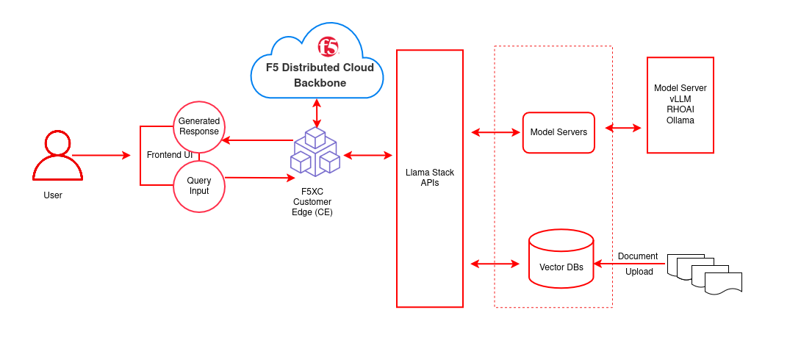

# Secure model inference with F5 Distributed Cloud API Security

Protect AI inference endpoints on Red Hat OpenShift AI with F5 Distributed Cloud WAAP—WAF, API spec enforcement, shadow API prevention, and rate limiting.

## Table of contents

- [Detailed description](#detailed-description)
  - [Architecture diagrams](#architecture-diagrams)
- [Requirements](#requirements)
  - [Minimum hardware requirements](#minimum-hardware-requirements)
  - [Minimum software requirements](#minimum-software-requirements)
  - [Required user permissions](#required-user-permissions)
- [Deploy](#deploy)
  - [Prerequisites](#prerequisites)
  - [Supported models](#supported-models)
  - [Installation steps](#installation-steps)
- [Delete](#delete)
- [References](#references)
- [Document management](#document-management)
- [Tags](#tags)

## Detailed description

This AI quickstart shows how to protect AI inference endpoints on Red Hat® OpenShift® AI using F5 Distributed Cloud (XC) Web App & API Protection (WAAP) and API Security. You deploy a KServe/vLLM model service in OpenShift AI, front it with an F5 XC HTTP Load Balancer, and enforce API discovery, OpenAPI schema validation, rate limiting, bot defense, and sensitive-data controls. OpenShift AI’s single-model serving is KServe-based (recommended for LLMs), and KServe’s HuggingFace/vLLM runtime exposes OpenAI-compatible endpoints, which are secured via F5 XC.

**Key components**

- **Red Hat OpenShift AI** – MLOps platform for developing and serving models at scale
- **F5 Distributed Cloud API Security** – LLM-aware threat detection, schema validation, and sensitive data redaction
- **Chat Assistant** – AI-powered chat interface
- **Direct Mode RAG** – Retrieval-Augmented Generation without agent complexity
- **Integration Blueprint** – Secure model inference across hybrid environments

### Architecture diagrams



| Layer/Component | Technology | Purpose/Description |
|-----------------|------------|---------------------|
| **Orchestration** | OpenShift AI | Container orchestration and GPU acceleration |
| **Framework** | LLaMA Stack | Core building blocks for AI application development |
| **UI Layer** | Streamlit | Chatbot interface for chat-based interaction |
| **LLM** | Llama-3.2-3B-Instruct | Generates contextual responses from retrieved documents |
| **Embedding** | all-MiniLM-L6-v2 | Text to vector embeddings |
| **Vector DB** | PostgreSQL + PGVector | Stores embeddings and semantic search |
| **Retrieval** | Vector Search | Retrieves relevant documents by similarity |
| **Storage** | S3 Bucket | Document source for enterprise content |

## Requirements

### Minimum hardware requirements

- **LLM inference**: GPU node (e.g. NVIDIA L4 or equivalent; see Supported Models table). The 70B model requires A100 x2 or equivalent.
- **Embedding-only**: CPU is sufficient for `all-MiniLM-L6-v2`.
- **Cluster resources**: minimum 8 vCPUs, 32 GB RAM, 100 GB disk for model weights and vector database.

<!-- TODO: verify CPU/RAM/disk values against your actual tested environment -->

### Minimum software requirements

- OpenShift Client CLI ([oc](https://docs.redhat.com/en/documentation/openshift_container_platform/4.18/html/cli_tools/openshift-cli-oc#installing-openshift-cli))
- Red Hat OpenShift Container Platform 4.18+
- Red Hat OpenShift AI 2.16+ (tested with 2.22)
- Helm CLI

<!-- TODO: verify the OpenShift AI version matches your tested environment -->
- Optional: [huggingface-cli](https://huggingface.co/docs/huggingface_hub/guides/cli), [Hugging Face token](https://huggingface.co/settings/tokens), [jq](https://stedolan.github.io/jq/) for example scripts

### Required user permissions

- Regular user for default deployment
- Cluster admin for advanced configurations (e.g. F5 XC integration)


## Deploy

### Prerequisites

- OpenShift cluster with OpenShift AI installed
- `oc` logged into the cluster
- Helm installed
- Hugging Face token and access to [Meta Llama](https://huggingface.co/meta-llama/Llama-3.2-3B-Instruct/) (and optionally [Llama Guard](https://huggingface.co/meta-llama/Llama-Guard-3-8B/) for safety)

### Supported models

| Function   | Model Name                             | Hardware    | AWS example      |
|-----------|----------------------------------------|-------------|------------------|
| Embedding | `all-MiniLM-L6-v2`                     | CPU/GPU/HPU | —                |
| Generation| `meta-llama/Llama-3.2-3B-Instruct`     | L4/HPU      | g6.2xlarge       |
| Generation| `meta-llama/Llama-3.1-8B-Instruct`     | L4/HPU      | g6.2xlarge       |
| Generation| `meta-llama/Meta-Llama-3-70B-Instruct` | A100 x2/HPU | p4d.24xlarge     |
| Safety    | `meta-llama/Llama-Guard-3-8B`          | L4/HPU      | g6.2xlarge       |

The 70B model is not required for initial testing. Llama-Guard-3-8B is optional.

### Installation steps

1. **Log in to OpenShift**
   ```bash
   oc login --token=<your_sha256_token> --server=<cluster-api-endpoint>
   ```

2. **Clone and go to the deployment directory**
   ```bash
   git clone https://github.com/rh-ai-quickstart/f5-api-security.git
   cd f5-api-security/deploy/helm
   ```

3. **Configure and deploy**
   ```bash
   cp rag-values.yaml.example rag-values.yaml
   vim rag-values.yaml   # or your preferred editor
   make install NAMESPACE=f5-ai-security
   ```

   The Makefile checks dependencies (helm, oc), creates the namespace, updates Helm dependencies, and installs the chart. Success looks like:
   ```
   [SUCCESS] rag installed successfully
   ```

4. **Verify (optional)**  
   List models:
   ```bash
   curl -sS http://llamastack-<NAMESPACE>.<YOUR_OPENSHIFT_CLUSTER>.com/v1/models
   ```
   Test chat (LlamaStack):
   ```bash
   curl -sS http://llamastack-<NAMESPACE>.<YOUR_OPENSHIFT_CLUSTER>.com/v1/openai/v1/chat/completions \
     -H "Content-Type: application/json" \
     -d '{"model": "<MODEL_ID>", "messages": [{"role": "user", "content": "Say hello in one sentence."}], "max_tokens": 64, "temperature": 0}' | jq
   ```
   For the secured vLLM endpoint, use your route and model ID in the same request format.

5. **Next steps**
   - **Step 2:** [Deployment and Configuration of F5 Distributed Cloud](docs/f5_xc_deployment.md)
   - **Step 3:** [Security Use Cases and Testing](docs/securing_model_inference_use_cases.md)

**Application access:** Get the route with `oc get route -n <namespace>`, open the URL in a browser, and configure LLM settings (XC URL, model ID, API key) in the web UI.

### Delete

Remove the quickstart from the cluster:

```bash
cd f5-api-security/deploy/helm
make uninstall NAMESPACE=f5-ai-security
```

This uninstalls the Helm release and removes pods, services, routes, and the pgvector PVC. To delete the namespace:

```bash
oc delete project f5-ai-security
```

## References

- **Make commands:**

  ```bash
  make help             # Show all available commands
  make install          # Deploy the application
  make uninstall        # Remove the application
  make clean            # Clean up all resources including namespace
  make logs             # Show logs for all pods
  make monitor          # Monitor deployment status
  make validate-config  # Validate configuration values
  ```

- [F5 Distributed Cloud](https://www.f5.com/cloud)
- [Red Hat OpenShift AI documentation](https://docs.redhat.com/en/documentation/red_hat_openshift_ai_self-managed)
- [KServe](https://kserve.github.io/website/)
- [vLLM project](https://docs.vllm.ai/)

## Document management

Documents can be uploaded directly through the UI.

**Supported formats:**
- **PDF documents** — Security policies, manuals, and reports
- **Text files** — Plain text documents

Navigate to **Settings → Vector Databases** to create vector databases and upload documents.

## Tags

<!-- TODO: verify the Industry tag matches your target audience -->

- **Title:** Secure model inference with F5 Distributed Cloud API Security
- **Description:** Protect AI inference endpoints on OpenShift AI with F5 XC WAAP: WAF, API spec enforcement, shadow API prevention, and rate limiting.
- **Industry:** Financial Services, Healthcare, Government (security-focused)
- **Product:** OpenShift AI, OpenShift
- **Use case:** security, API protection, model inference
- **Contributor org:** F5 / Red Hat