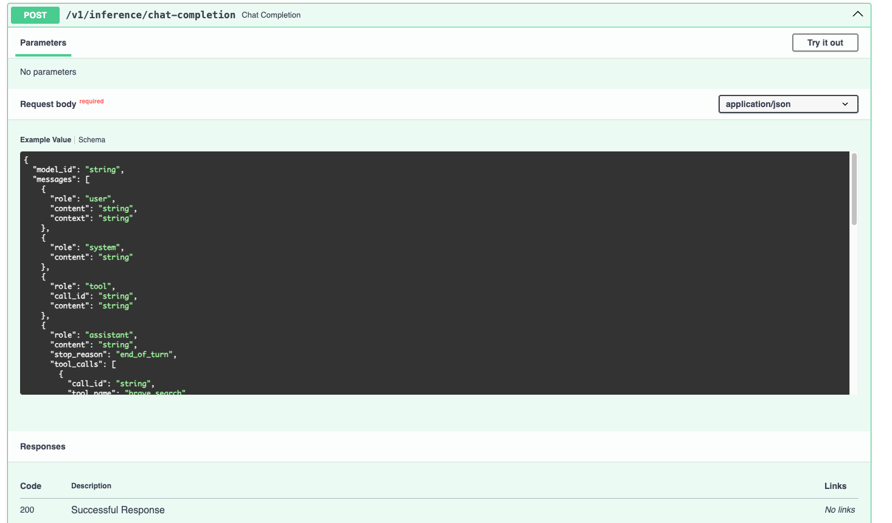
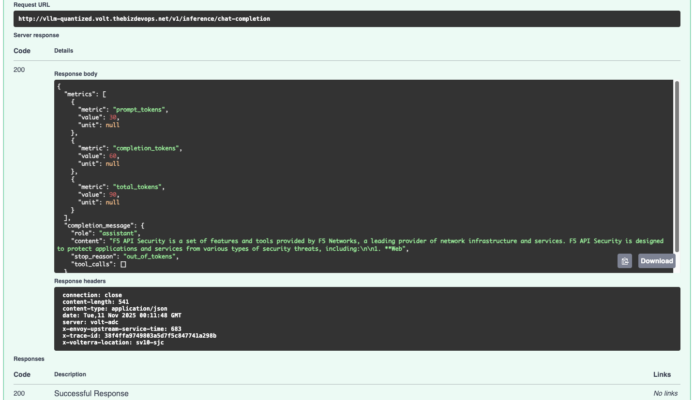

# Securing AI Model Inference Endpoints with F5 Distributed Cloud WAAP

This lab guides you through configuring **F5 Distributed Cloud (XC) Web Application and API Protection (WAAP)** features to secure a Generative AI model inference endpoint (represented by `llamastack.f5-ai-security` running in a vK8s environment).

**Objective:** Secure the inference endpoint from prompt injection, shadow APIs, sensitive data leakage, and automated attacks.

---

## 🧩 Prerequisites

- Operational **F5 Distributed Cloud Account** and Console access  
- **kubectl** installed locally

---

## Step 0: Initial Load Balancer Configuration and Inference Endpoint Verification

This step ensures the model serving application is exposed via an F5 Distributed Cloud HTTP Load Balancer (LB).

### Task 0.1: Verify llamastack Service Running in OpenShift

1. **Check Service Status**  
   - Ensure that the `llamastack` service is deployed and running properly within your OpenShift project or namespace.  
   - Run the following commands to verify that the pods, service, and endpoints are active:

```bash
oc get pods -n <your-namespace> | grep llama
oc get svc -n <your-namespace> | grep llama
oc get endpoints -n <your-namespace> | grep llama
```

Expected Output:
```
llamastack-f5-ai-security   ClusterIP   10.0.142.12   <none>   8080/TCP   2d
llamastack-f5-ai-security-7d9c7b9d9f   1/1     Running   0     2d
```

2. **Confirm Service Accessibility (Internal Test)**  
   - You can test the inference service directly from within the OpenShift cluster to confirm it’s responding before integrating with F5 Distributed Cloud:

```bash
oc run test-client --rm -i --tty --image=registry.access.redhat.com/ubi9/ubi-minimal -- curl -s http://llamastack-f5-ai-security.<your-namespace>.svc.cluster.local:8080/v1/openai/v1/models | jq
```

Expected JSON output should show available models such as `Llama-3.2-1B-Instruct-quantized.w8a8`.

### Task 0.2: Set up the HTTP Load Balancer

1. Navigate to **Multi-Cloud App Connect → HTTP Load Balancers**  
2. Click **Add HTTP Load Balancer**
   - **Name:** `ai-inference-lb`  
   - **Domain Name:** `vllm-quantized.volt.thebizdevops.net`
3. **Configure Origin Pool:**
   - Add Item → name the pool  
4. **Configure Origin Server:**
   - Type: *K8s Service Name of Origin Server on given Sites*  
   - Service Name: `llamastack.f5-ai-security`  
   - Virtual Site Type: `yourside`  (ex. `system/ericji-gpu-ai-pod` )
   - Network: `Outside Network`  


   - Port: `8321`


5. **Save LB:** Continue → Apply → Save and Exit. Record the generated **CNAME**.

### Verification of Inference Endpoint Access

```bash
curl -sS http://vllm-quantized.volt.thebizdevops.net//v1/openai/v1/models | jq
```
Expected Output:
```json
{
  "data": [
    {
      "id": "remote-llm/RedHatAI/Llama-3.2-1B-Instruct-quantized.w8a8",
      "object": "model",
      "created": 1762644418,
      "owned_by": "llama_stack"
    },
    {
      "id": "sentence-transformers/all-MiniLM-L6-v2",
      "object": "model",
      "created": 1762644418,
      "owned_by": "llama_stack"
    }
  ]
}
```

---

## 🧱 Use Case 1 — Protecting the vLLM Inference Endpoint using WAF

**Scenario:** The LLM inference endpoint is susceptible to dynamic attacks, such as Cross‑Site Scripting (XSS), which could allow malicious scripts to be rendered and executed, posing an unacceptable security risk. This guide shows how to use the F5 Distributed Cloud (XC) Web Application Firewall (WAF) to mitigate the vulnerability.

---

### Task 1 — Simulate an Unmitigated Attack via Swagger UI (Before WAF)

In this task you will simulate an XSS attack against the unprotected LLM endpoint using the interactive API documentation (Swagger UI).
1. **Navigate to the Swagger UI**  
   Open a browser tab and go to:  
   `http://vllm-quantized.volt.thebizdevops.net/docs#/default/chat_completion_v1_inference_chat_completion_post`

2. **Access the Endpoint**  
   Expand the Chat Completion endpoint (`/v1/inference/chat-completion`) in the Swagger UI.

3. **Initiate Testing**  
   Click the **Try it out** button.



3. **Insert Malicious Payload**  

   Copy and paste the following JSON payload into the **Request body**.  
   This payload injects a simple XSS `<script>` into the `content` field to demonstrate the vulnerability:

```json
{
  "model_id": "RedHatAI/Llama-3.2-1B-Instruct-quantized.w8a8",
  "messages": [
    {
      "role": "user",
      "content": "What is F5 API security? <script>alert(\"XSS\")</script>",
      "context": "Injection test"
    }
  ],
  "sampling_params": {
    "strategy": { "type": "greedy" },
    "max_tokens": 50,
    "repetition_penalty": 1,
    "stop": ["</script>"]
  },
  "stream": false,
  "logprobs": { "top_k": 0 }
}
```

> Replace `model` and other fields with the values required by your deployment if different.
4. **Execute the Attack**  
   Click **Execute** in Swagger UI.
   
5. **Review Unmitigated Result**  
   Inspect the **Server Response**. If the response body contains the injected `<script>` (or the script is rendered), the endpoint is vulnerable to XSS.


---

### Task 2 — Enable a WAF Policy on the F5 XC Load Balancer

Attach a pre-built WAF policy to the HTTP Load Balancer fronting the vLLM service.

1. **Navigate to Load Balancer Management**  
   In the F5 Distributed Cloud Console, go to **Web App & API Protection → Load Balancers → HTTP Load Balancers** (under *Manage*).

2. **Manage Configuration**  
   Find the HTTP Load Balancer servicing the vLLM endpoint. Click the action menu (three dots `…`) in the *Action* column, then select **Manage Configuration**.

3. **Edit Configuration**  
   Click **Edit Configuration**.

4. **Enable WAF**  
   From the left navigation, select **Web Application Firewall**.

5. **Select WAF Object**  
   Toggle **Enable** for the Web Application Firewall, then choose the shared WAF object (for example `shared/api-lab-af`) from the WAF dropdown.

   - **Note:** In lab environments, settings such as *Suspicious* or *Good Bot* are sometimes set to *Ignore* to reduce false positives.

6. **Save Changes**  
   Go to **Other Settings** (left navigation), then click **Save and Exit**.

**Insert Screen Capture:** Add a screenshot here showing the WAF policy attached to the F5 XC Load Balancer.

---

### Task 3 — Simulate a Mitigated Attack via Swagger UI (After WAF)

Verify the WAF policy successfully blocks the XSS injection.

1. **Return to Swagger UI**  
   Use the Swagger tab from Task 1 (or refresh the page):  
   `http://vllm-quantized.volt.thebizdevops.net/docs#/default/chat_completion_v1_inference_chat_completion_post`

2. **Access the Endpoint**  
   Expand the `/v1/inference/chat-completion` endpoint and click **Try it out**.

3. **Re-Execute the Attack**  
   Paste the exact same malicious JSON payload used in Task 1 into the Request body.

4. **Execute and Review Mitigated Result**  
   Click **Execute**. Inspect the **Server Response**. The WAF should have intercepted and blocked the malicious script; you will typically see a block message or an altered response indicating the request was rejected or sanitized.

**Insert Screen Capture:** Add a screenshot here of the mitigated Swagger response showing the WAF block message or sanitized output.

---

## Notes & Troubleshooting

- If the block is not observed:
  - Confirm the WAF policy is attached to the **correct** HTTP Load Balancer (matching host/path).
  - Check policy precedence and any other policies that might override behavior.
  - Review WAF logs and attack telemetry in the F5 XC Console to confirm detection events.
  - Validate whether the WAF object is configured to **block** (not just log) for XSS rules.

- For lab-friendly testing, consider using a non-production model and a low-impact payload. Use caution when testing production systems.

---

## Appendix — Example Minimal Request (cURL)

Below is an example `curl` command that sends the same malicious payload directly to the inference endpoint (use only in controlled/test environments):

```bash
curl -X POST "http://vllm-quantized.volt.thebizdevops.net/v1/inference/chat-completion" \
  -H "Content-Type: application/json" \
  -d '{
    "model": "gpt-example",
    "messages": [{"role":"user","content":"<script>alert(\"XSS\")</script> Please summarize the above."}],
    "max_tokens": 50
  }'
```

---

*End of document.*


---

## 🧾 Use Case 2: Enforcing API Specification, Sensitive Data Detection, and Preventing Shadow APIs

This use case enforces documented API access only and uses **API Discovery** for continuous visibility.

### Task 2.1: Upload API Specification

1. Go to **Swagger Files → Add Swagger File** → name it → upload OpenAPI spec → Save  
2. Go to **API Definition → Add API Definition** → select uploaded spec → Save

### Task 2.2: Apply API Protection and Deny Shadow APIs

1. Edit LB → enable **API Definition** and select your definition  
2. Under **Common Security Controls**, choose **Apply Specified Service Policies**  
3. Add Custom Rules:  
   - **Rule 1:** Deny traffic not matching `/v1/` (invert string matcher)  
   - **Rule 2:** Allow all others  
4. Save and Exit

*(Note: If “exhausted limits” error appears, request API schema limit increase via support.)*

### Task 2.3: Traffic Generation and API Confirmation

1. Access LLM docs endpoint → execute API calls and try undocumented paths  
2. Before policy: vulnerable; after policy: protected  
3. Review **API Discovery Dashboard** for detected endpoints and sensitive data

📸 *[Insert Screenshot 4: API Discovery Dashboard Highlighting Sensitive Data or Shadow APIs]*

---

## ⚙️ Use Case 3: Mitigating Automated Attack Traffic and Excessive Requests (Bot/DDoS/Rate Limiting)

This protects inference endpoints from resource exhaustion and denial of service.

### Task 3.1: Configure Bot Protection

1. Edit LB → **Bot Protection → Enable → Configure**  
2. Add App Endpoint:  
   - Methods: PUT, POST  
   - Path: `/api/v1/`  
   - Mitigation: Block (403)  
3. Save and Exit

### Task 3.2: Configure Rate Limiting and DDoS Protection

1. Enable **IP Reputation:** categories – Spam, DoS, Proxy, Tor, Botnets  
2. Configure **Rate Limiting:**  
   - Number: `10` requests  
   - Burst Multiplier: `5`  
3. Enable **DDoS Protection:**  
   - Add IP Source Rule → block `203.0.113.0/24`

### Task 3.3: Traffic Generation and Confirmation

1. Simulate bot traffic using Test Tool or `ab` load tests  
2. Before: traffic passes; after: blocked  
3. Review **Security Dashboard → Bot Defense & DDoS Tabs** for analytics

📸 *[Insert Screenshot 5: Bot Defense Dashboard Showing Blocked Traffic]*
