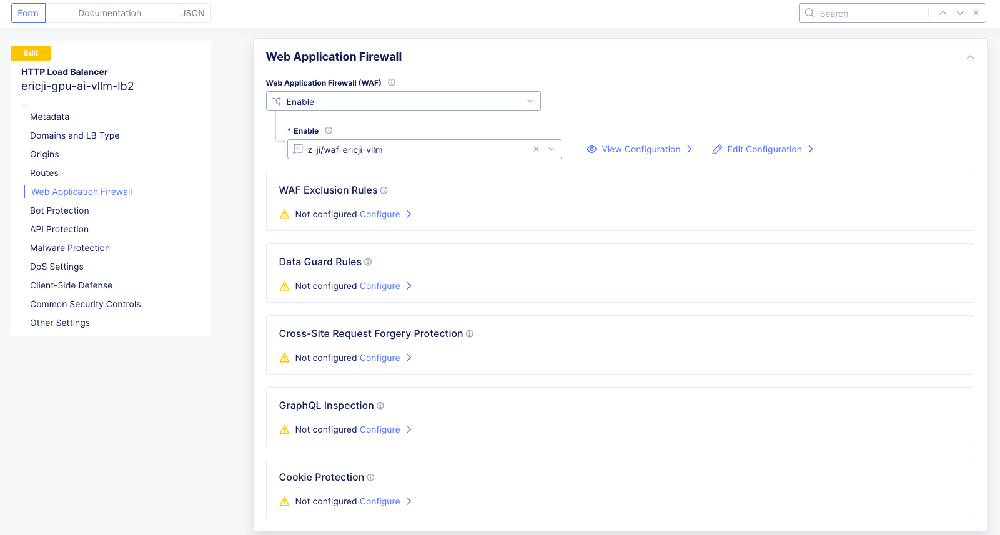
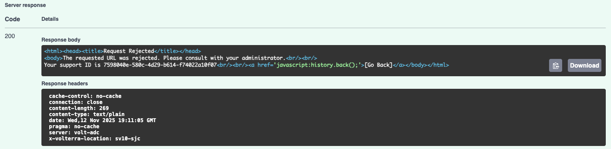
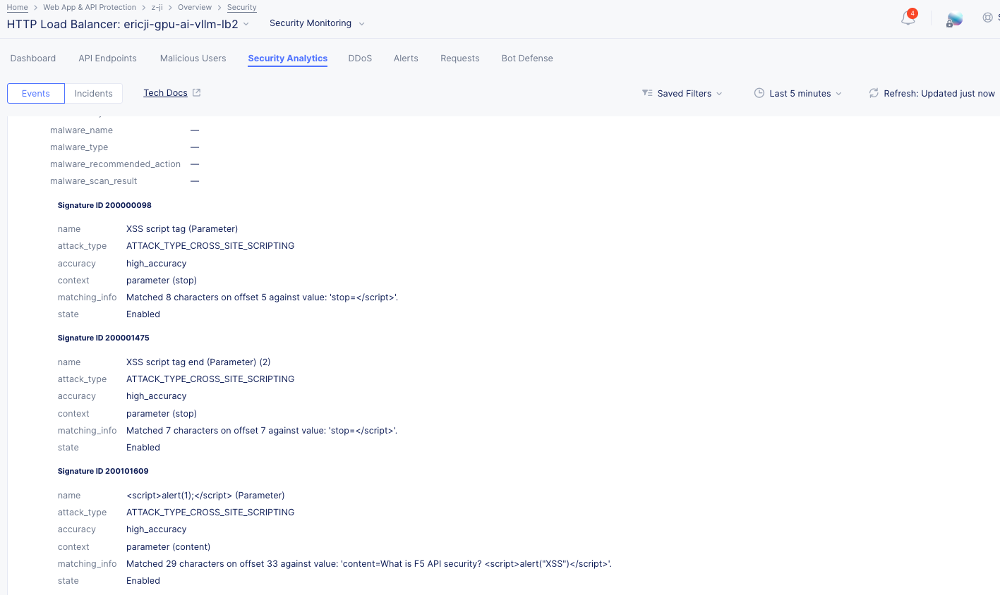
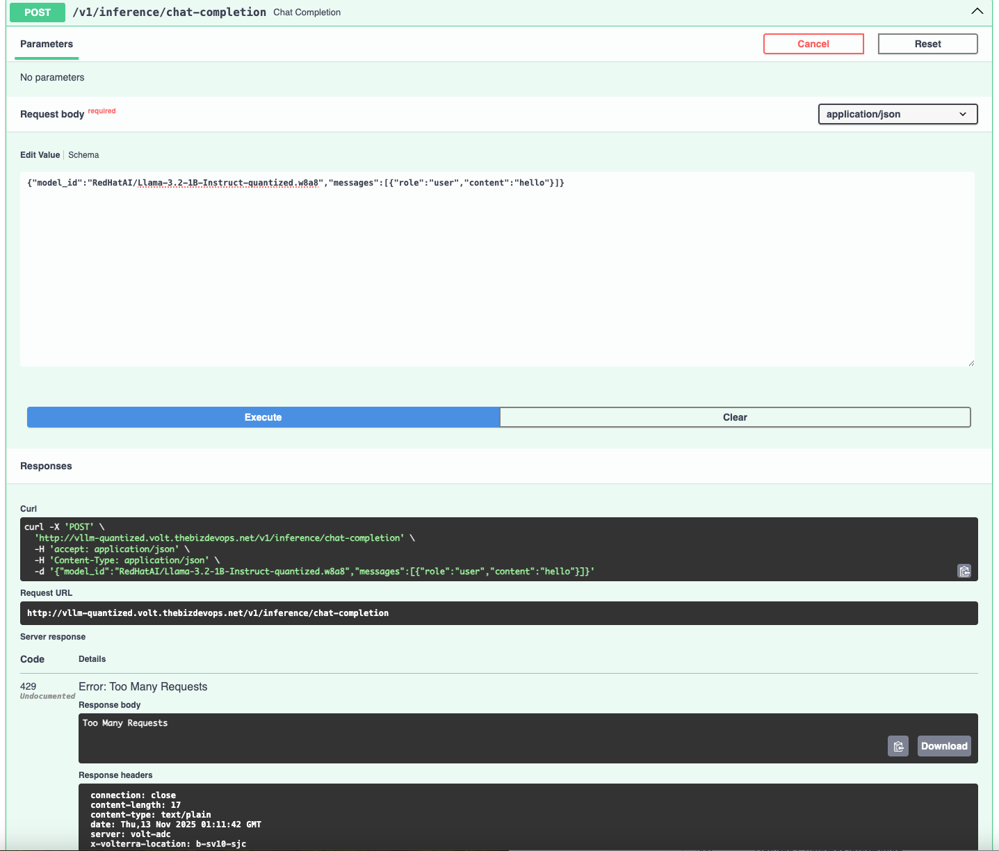
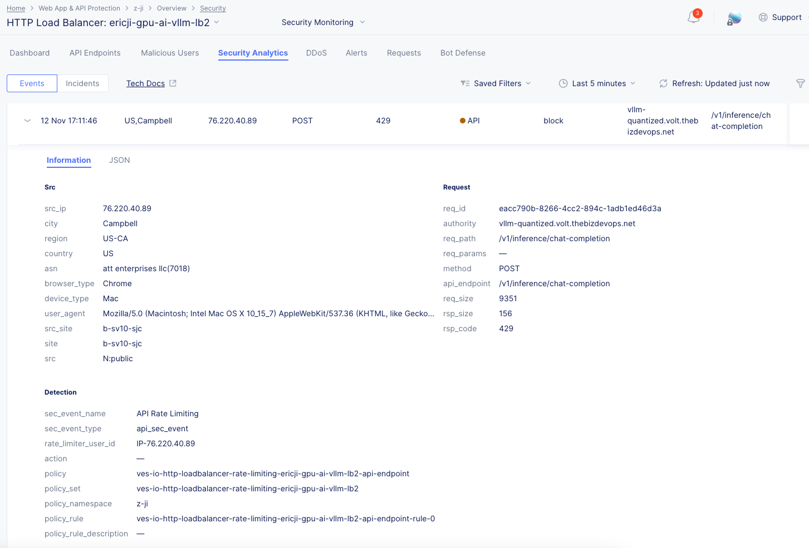

<!-- omit from toc -->
# Securing AI Model Inference Endpoints with F5 Distributed Cloud WAAP

This lab guides you through configuring **F5 Distributed Cloud (XC) Web Application and API Protection (WAAP)** features to secure a Generative AI model inference endpoint (represented by `llamastack.f5-ai-security` running in a vK8s environment).

**Objective:** Secure the inference endpoint from prompt injection, shadow APIs, sensitive data leakage, and automated attacks.

<!-- omit from toc -->
## Table of contents

<!-- TOC depthFrom:2 depthTo:3 -->
- [🧩 Prerequisites](#-prerequisites)
- [Step 0: Initial Load Balancer Configuration and Inference Endpoint Verification](#step-0-initial-load-balancer-configuration-and-inference-endpoint-verification)
  - [Task 0.1: Verify llamastack Service Running in OpenShift](#task-01-verify-llamastack-service-running-in-openshift)
  - [Task 0.2: Set up the HTTP Load Balancer](#task-02-set-up-the-http-load-balancer)
  - [Verification of Inference Endpoint Access](#verification-of-inference-endpoint-access)
- [🧱 Use Case 1 — Protecting the vLLM Inference Endpoint using WAF](#-use-case-1--protecting-the-vllm-inference-endpoint-using-waf)
  - [Task 1 — Simulate an Unmitigated Attack via Swagger UI (Before WAF)](#task-1--simulate-an-unmitigated-attack-via-swagger-ui-before-waf)
  - [Task 2 — Enable a WAF Policy on the F5 XC Load Balancer](#task-2--enable-a-waf-policy-on-the-f5-xc-load-balancer)
  - [Task 3 — Simulate a Mitigated Attack via Swagger UI (After WAF)](#task-3--simulate-a-mitigated-attack-via-swagger-ui-after-waf)
  - [Notes \& Troubleshooting](#notes--troubleshooting)
  - [Appendix — Example Minimal Request (cURL)](#appendix--example-minimal-request-curl)
- [🧾Use Case 2: Enforcing API Specification, Sensitive Data Detection, and Preventing Shadow APIs](#use-case-2-enforcing-api-specification-sensitive-data-detection-and-preventing-shadow-apis)
  - [Scenario](#scenario)
  - [Task 1: Simulate Allowed Access to a Shadow API](#task-1-simulate-allowed-access-to-a-shadow-api)
  - [Task 2: API Definition](#task-2-api-definition)
  - [Task 3: Enabling API Inventory and Blocking Shadow APIs](#task-3-enabling-api-inventory-and-blocking-shadow-apis)
  - [Task 4: Simulate Blocked Access to a Shadow API](#task-4-simulate-blocked-access-to-a-shadow-api)
  - [Summary](#summary)
- [⚙️Use Case 3: Preventing Denial of Service (DoS) Attacks via Rate Limiting](#️use-case-3-preventing-denial-of-service-dos-attacks-via-rate-limiting)
  - [Scenario](#scenario-1)
  - [Task 3.1: Simulate Unmitigated Excessive Requests](#task-31-simulate-unmitigated-excessive-requests)
  - [Task 3.2: Configure Rate Limiting](#task-32-configure-rate-limiting)
  - [Task 3.3: Simulate Mitigated Excessive Requests](#task-33-simulate-mitigated-excessive-requests)
---

## 🧩 Prerequisites

- Operational **F5 Distributed Cloud Account** and Console access  
- **kubectl** installed locally

---

## Step 0: Initial Load Balancer Configuration and Inference Endpoint Verification

This step ensures the model serving application is exposed via an F5 Distributed Cloud HTTP Load Balancer (LB).

### Task 0.1: Verify llamastack Service Running in OpenShift

1. **Check Service Status**  
   - Ensure that the `llamastack` service is deployed and running properly within your OpenShift project or namespace.  
   - Run the following commands to verify that the pods, service, and endpoints are active:

```bash
oc get pods -n <your-namespace> | grep llama
oc get svc -n <your-namespace> | grep llama
oc get endpoints -n <your-namespace> | grep llama
```

Expected Output:
```
llamastack-f5-ai-security   ClusterIP   10.0.142.12   <none>   8080/TCP   2d
llamastack-f5-ai-security-7d9c7b9d9f   1/1     Running   0     2d
```

2. **Confirm Service Accessibility (Internal Test)**  
   - You can test the inference service directly from within the OpenShift cluster to confirm it’s responding before integrating with F5 Distributed Cloud:

```bash
oc run test-client --rm -i --tty --image=registry.access.redhat.com/ubi9/ubi-minimal -- curl -s http://llamastack-f5-ai-security.<your-namespace>.svc.cluster.local:8080/v1/openai/v1/models | jq
```

Expected JSON output should show available models such as `Llama-3.2-1B-Instruct-quantized.w8a8`.

### Task 0.2: Set up the HTTP Load Balancer

1. Navigate to **Multi-Cloud App Connect → HTTP Load Balancers**  
2. Click **Add HTTP Load Balancer**
   - **Name:** `ai-inference-lb`  
   - **Domain Name:** `your-xc-endpoint.com`
3. **Configure Origin Pool:**
   - Add Item → name the pool  
4. **Configure Origin Server:**
   - Type: *K8s Service Name of Origin Server on given Sites*  
   - Service Name: `llamastack.f5-ai-security`  
   - Virtual Site Type: `yourside`  (ex. `system/ericji-gpu-ai-pod` )
   - Network: `Outside Network`  


   - Port: `8321`


5. **Save LB:** Continue → Apply → Save and Exit. Record the generated **CNAME**.

### Verification of Inference Endpoint Access

```bash
curl -sS http://your-xc-endpoint.com/v1/openai/v1/models | jq
```
Expected Output:
```json
{
  "data": [
    {
      "id": "remote-llm/RedHatAI/Llama-3.2-1B-Instruct-quantized.w8a8",
      "object": "model",
      "created": 1762644418,
      "owned_by": "llama_stack"
    },
    {
      "id": "sentence-transformers/all-MiniLM-L6-v2",
      "object": "model",
      "created": 1762644418,
      "owned_by": "llama_stack"
    }
  ]
}
```

---

## 🧱 Use Case 1 — Protecting the vLLM Inference Endpoint using WAF

**Scenario:** The LLM inference endpoint is susceptible to dynamic attacks, such as Cross‑Site Scripting (XSS), which could allow malicious scripts to be rendered and executed, posing an unacceptable security risk. This guide shows how to use the F5 Distributed Cloud (XC) Web Application Firewall (WAF) to mitigate the vulnerability.

---

### Task 1 — Simulate an Unmitigated Attack via Swagger UI (Before WAF)

In this task you will simulate an XSS attack against the unprotected LLM endpoint using the interactive API documentation (Swagger UI).
1. **Navigate to the Swagger UI**  
   Open a browser tab and go to:  
   `http://your-xc-endpoint.com/docs#/default/chat_completion_v1_inference_chat_completion_post`

2. **Access the Endpoint**  
   Expand the Chat Completion endpoint (`/v1/inference/chat-completion`) in the Swagger UI.

3. **Initiate Testing**  
   Click the **Try it out** button.


3. **Insert Malicious Payload**  

   Copy and paste the following JSON payload into the **Request body**.  
   This payload injects a simple XSS `<script>` into the `content` field to demonstrate the vulnerability:

```json
{
  "model_id": "RedHatAI/Llama-3.2-1B-Instruct-quantized.w8a8",
  "messages": [
    {
      "role": "user",
      "content": "What is F5 API security? <script>alert(\"XSS\")</script>",
      "context": "Injection test"
    }
  ],
  "sampling_params": {
    "strategy": { "type": "greedy" },
    "max_tokens": 50,
    "repetition_penalty": 1,
    "stop": ["</script>"]
  },
  "stream": false,
  "logprobs": { "top_k": 0 }
}
```

> Replace `model` and other fields with the values required by your deployment if different.
4. **Execute the Attack**  
   Click **Execute** in Swagger UI.

5. **Review Unmitigated Result**  
   Inspect the **Server Response**. If the response body contains the injected `<script>` (or the script is rendered), the endpoint is vulnerable to XSS.


### Task 2 — Enable a WAF Policy on the F5 XC Load Balancer

Attach a pre-built WAF policy to the HTTP Load Balancer fronting the vLLM service.

1. **Navigate to Load Balancer Management**  
   In the F5 Distributed Cloud Console, go to **Web App & API Protection → Load Balancers → HTTP Load Balancers** (under *Manage*).

2. **Manage Configuration**  
   Find the HTTP Load Balancer servicing the vLLM endpoint. Click the action menu (three dots `…`) in the *Action* column, then select **Manage Configuration**.

3. **Edit Configuration**  
   Click **Edit Configuration**.

4. **Enable WAF**  
   From the left navigation, select **Web Application Firewall**.


1. **Create a new WAF Object**  
   Toggle **Enable** for the Web Application Firewall, then create a new WAF object (for example `waf-ericji-vllm`)

   - **Note:** In lab environments, settings such as *Suspicious* or *Good Bot* are sometimes set to *Ignore* to reduce false positives.

1. **Save Changes**  
   Go to **Other Settings** (left navigation), then click **Save and Exit**.


---

### Task 3 — Simulate a Mitigated Attack via Swagger UI (After WAF)

Verify the WAF policy successfully blocks the XSS injection.

1. **Return to Swagger UI**  
   Use the Swagger tab from Task 1 (or refresh the page):  
   `http://your-xc-endpoint.com/docs#/default/chat_completion_v1_inference_chat_completion_post`

2. **Access the Endpoint**  
   Expand the `/v1/inference/chat-completion` endpoint and click **Try it out**.

3. **Re-Execute the Attack**  
   Paste the exact same malicious JSON payload used in Task 1 into the Request body.

4. **Execute and Review Mitigated Result**  

   Click **Execute**. Inspect the **Server Response**. The WAF should have intercepted and blocked the malicious script; you will typically see a block message or an altered response indicating the request was rejected or sanitized.



5. **Check with event log from F5 Distributed Cloud Security Analytics**  




---

### Notes & Troubleshooting

- If the block is not observed:
  - Confirm the WAF policy is attached to the **correct** HTTP Load Balancer (matching host/path).
  - Check policy precedence and any other policies that might override behavior.
  - Review WAF logs and attack telemetry in the F5 XC Console to confirm detection events.
  - Validate whether the WAF object is configured to **block** (not just log) for XSS rules.

- For lab-friendly testing, consider using a non-production model and a low-impact payload. Use caution when testing production systems.

---

### Appendix — Example Minimal Request (cURL)

Below is an example `curl` command that sends the same malicious payload directly to the inference endpoint (use only in controlled/test environments):

```bash
curl -X 'POST' 'http://your-xc-endpoint.com/v1/inference/chat-completion' \
  -H 'Content-Type: application/json' \
  -d '{
        "model_id": "RedHatAI/Llama-3.2-1B-Instruct-quantized.w8a8",
        "messages": [
          {
            "role": "user",
            "content": "What is F5 API security? <script>alert(\"XSS\")</script>",
            "context": "Injection test"
          }
        ],
          "max_tokens": 50
      }' | jq
```

---

## 🧾Use Case 2: Enforcing API Specification, Sensitive Data Detection, and Preventing Shadow APIs

### Scenario
An updated model inference service (KServe/vLLM) introduced a new, unapproved, or unvalidated API endpoint (e.g., a version check endpoint) which was not intended for external release. This unapproved endpoint is considered a **Shadow API**. We need to leverage **F5 Distributed Cloud (XC) API Security** to ensure that only documented, approved endpoints can be consumed, thereby protecting the Model Inference stack.

**Prerequisite:** Ensure the HTTP Load Balancer and the LLM inference service are deployed on Red Hat OpenShift AI.

---

### Task 1: Simulate Allowed Access to a Shadow API
Verify that the unapproved endpoint is currently accessible before security controls are applied.

1. Use a browser or `curl` to test the Shadow API endpoint:  
   - **Shadow API:** `GET http://your-xc-endpoint.com/v1/version`  
   - The response should return version information, proving that the Shadow API is currently accessible.


2. *(Optional)* Use the Quickstart’s Swagger UI to confirm the endpoint is exposed:  
   - **Swagger UI:** `http://your-xc-endpoint.com/docs`

---

### Task 2: API Definition
Create an API Definition using the approved OpenAPI specification for the model inference service.

1. Navigate to **Web App & API Protection** in the F5 Distributed Cloud console.
2. Go to **Manage → API Security → API Definition**.
3. Click **Add API Definition**.

4. Enter a name (e.g., `model-api-def`).
5. Under **OpenAPI Specification Files**, click **Add Item**.

1. Upload/select the approved file: `openapi-swagger-v3-fixed2-version.json`.
2. Click **Save and Exit**.

---

### Task 3: Enabling API Inventory and Blocking Shadow APIs
Enable API Inventory & Discovery on the Load Balancer fronting the inference endpoint.

1. Go to **Manage → Load Balancers → HTTP Load Balancers**.
2. Locate the Load Balancer for the LLM service → click **… → Manage Configuration**.
3. Click **Edit Configuration**.
4. Select **API Protection** from the left navigation.
5. In the first API Definition section, select **Enable**.
6. In the second API Definition section, select the definition created in Task 2.


7. Under **Validation**, choose **API Inventory**, then click **View Configuration**.
   
8. Change **Fall Through Mode** to **Custom**.
9.  Under **Custom Fall Through Rule List**, choose **Configure**.
       

10. Add an item with:
    - **Name:** block-shadow  
    - **Action:** Block  
    - **Type:** Base Path  
    - **Base Path:** `/v1`  
       

11. Click **Apply**.
12. Select **Other Settings**, then **Save and Exit**.

---

### Task 4: Simulate Blocked Access to a Shadow API
After enforcing the API spec, the Shadow API should now be blocked.

1. Test using browser or `curl`:  
   - `GET http://your-xc-endpoint.com/v1/version`
2. The request should now be blocked, confirming that undocumented/unauthorized endpoints are prevented.
    
---

### Summary
Enforcing the API specification acts like a strict **security manifest** for a production line. Anything not explicitly approved in the OpenAPI file (`openapi-swagger-v3-fixed2-version.json`) is immediately rejected by **F5 API Security**, preventing the exposure of Shadow APIs.


---

## ⚙️Use Case 3: Preventing Denial of Service (DoS) Attacks via Rate Limiting

### Scenario
An LLM inference endpoint, running on OpenShift AI and exposed at [http://your-xc-endpoint.com](http://your-xc-endpoint.com), experiences performance degradation due to a high volume of requests from a single client source, potentially caused by accidental loops or intentional abuse.  
We will limit requests to a specific endpoint to **10 requests per client per minute**.

**Selected Endpoint for Rate Limiting:** `/v1/inference/chat-completion`  
*(This is the specific LLM inference path targeted for protection.)*

---

### Task 3.1: Simulate Unmitigated Excessive Requests
This task demonstrates that without F5 XC rate limiting configured, the selected LLM inference endpoint will accept an unlimited number of requests from a single client.

1. **Navigate to the Swagger URL:**  
   Open a browser tab and navigate to [http://your-xc-endpoint.com/docs](http://your-xc-endpoint.com/docs).
2. **Access the Target Endpoint:**  

   Within the Swagger page, navigate and expand the selected endpoint (e.g., `/v1/inference/chat-completion`). Click **Try it out**.
   


3.  **Insert Payload**  

   Copy and paste the following JSON payload into the **Request body**.  

```json
{
  "model_id": "RedHatAI/Llama-3.2-1B-Instruct-quantized.w8a8",
  "messages": [
    {"role": "user", "content": "Hello"}
  ]
}
```
> Replace `model` and other fields with the values required by your deployment if different.

4. **Execute Rapid Requests:**  
   Click the **Execute** button repeatedly, simulating excessive requests (e.g., click Execute 10 or more times within 1 minute).


5. **Review Unmitigated Result:**  
   Observe the **Response Body** for each execution. Since no rate limiting is enforced, every request should be processed and return a `200 OK` status.

📸 *[Insert Screen Capture of Unmitigated Swagger Response showing >10 successful 200 OK responses]*

---

### Task 3.2: Configure Rate Limiting
This task enables the **API Rate Limit** feature on the **F5 XC HTTP Load Balancer** to protect the selected vLLM inference endpoint.

1. **Access Load Balancer Configuration:**  
   In the F5 Distributed Cloud Console, navigate to **Web App & API Protection → Load Balancers → HTTP Load Balancers** under the *Manage* section.
2. **Manage and Edit Configuration:**  
   Locate the HTTP Load Balancer serving `your-xc-endpoint.com`. Click the three dots (…) in the *Action* column, then select **Manage Configuration → Edit Configuration**.
3. **Navigate to Common Security Controls:**  
   Using the left-hand navigation, click the **Common Security Controls** link.
4. **Enable API Rate Limit:**  
   Locate the **Rate Limiting** area and use the drop-down to select **API Rate Limit**.


5. **View and Configure:**  
   In the expanded menu under API Rate Limit, click **View Configuration**. In the resulting window, under *API Endpoints*, click **Configure**.
6. **Add Item:**  
   Select **Add Item** within API Endpoints.
7. **Select LLM Endpoint:**  
   In the new configuration window, use the drop-down under **API Endpoint** and click **See Suggestions**. In the suggestion results, select the LLM inference endpoint (e.g., `/v1/inference/chat-completion`).
8. **Define Threshold:**  
   Update the configuration fields and click **Apply**:
   - **Method List:** ANY  
   - **Threshold:** 10  
   - **Duration:** Minute  
     *(This configuration will rate limit a client after making 10 requests within 1 minute.)*


9. **Apply and Save:**
   - Review the API Endpoint rate limiting rule and click **Apply**.  
   - Click **Apply** on the API Rate Limit page.  
   - Navigate to **Other Settings** on the left, then click **Save and Exit** on the bottom right.

📸 *[Insert Screen Capture of F5 XC Configuration showing the Rate Limit rule applied to the LLM endpoint with Threshold 10/Minute]*

---

### Task 3.3: Simulate Mitigated Excessive Requests
This task verifies that the rate limiting policy is active and successfully blocks requests that exceed the defined threshold.

1. **Return to Swagger UI:**  
   Navigate to the API documentation URL (or refresh the page): [http://your-xc-endpoint.com/docs](http://your-xc-endpoint.com/docs).
2. **Access the Target Endpoint:**  
   Navigate and expand the rate-limited endpoint (e.g., `/v1/inference/chat-completion`) and click **Try it out**.
3. **Execute Rapid Requests:**  
   Click the **Execute** button more than 10 times within 1 minute.

4. **Review Mitigated Result:**  
   Observe the **Server Response Body** for each execution:
   - Requests 1 through 10 should be processed successfully (`200 OK`).  
   - Requests 11 and subsequent requests within that minute duration should be blocked (e.g., returning a `429 Too Many Requests` status or a comparable block message).



5. **Review Dashboad**




